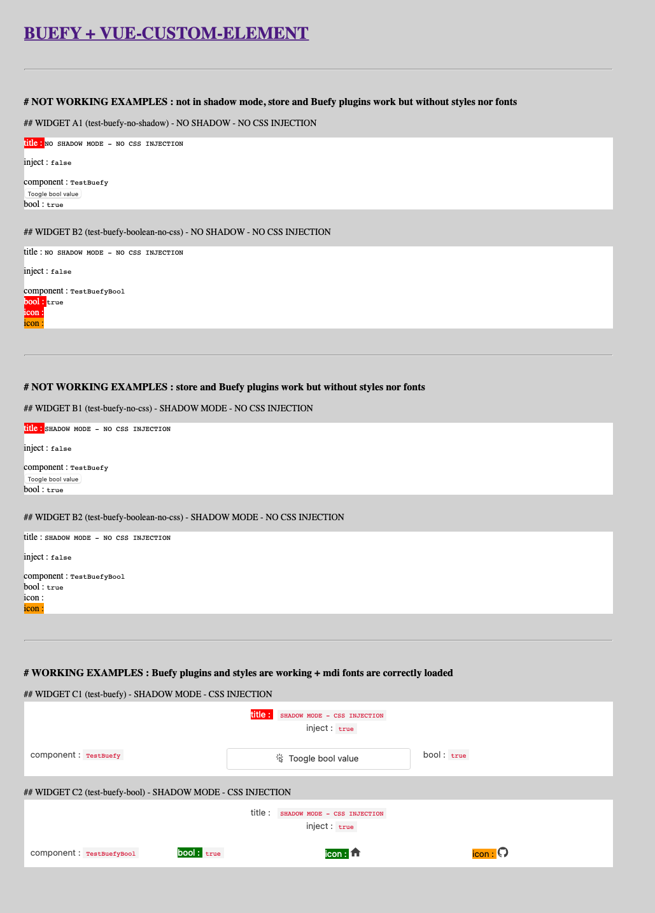

# VUE-CUSTOM-ELEMENT with BUEFY

This boilerplate project aims to use [`vue-custom-element` library](https://github.com/karol-f/vue-custom-element) with Vue2, and use [`Buefy`](https://buefy.org/documentation/start) as a plugin/CSS framework, [Material design fonts](https://materialdesignicons.com) for the icons, all above encapsulating the CSS in every custom element's (or widget's) shadow DOM.

For test purposes we also created a shared vuex `store` between components, so a encapsulated widget could have an effect on anoter.

This project aimed to find an answer to [this issue](https://github.com/karol-f/vue-custom-element/issues/268).

## Notes

### Why Vue2 ?

As we write this, `Buefy` is not supporting Vue3. So to make custom element using Buefy as a vue plugin we had to use Vue2, and `vue-custom-element` still seems the best way to make custom elements with vue2.

### Inject CSS in shadow DOM

Due to the way `vue-custom-element` works the CSS must be imported and injected as strings in the custom-element options (`shadowCss`) in `main.js`. To do so we used the [`raw-loader` library](https://www.npmjs.com/package/raw-loader).

As the widgets are encapsulated in a `shadow-root` most of the buefy CSS only applies to the component. But still, some CSS selectors are by default set to `inherit` from the parents (when the style is something like `box-sizing: inherit`). To solve that problem we had to create a specific css file we also injected after injecting the buefy and material design css files (`./src/styles/initialize.css`).

### Vue and scoped styles in shadow mode

In shadow mode the `scoped` styles usually used in Vue are useless : those styles are injected into the `<head>` tag, not reachable by the custom element within their `shadow-root`. To be able to apply different styles to specific components, even nested, we had to find a workaround : we created a `mixin` function available on all components (`this.addStyle(url)`) able to generate a `<link>` tag pointing to specific css files (in the public folder) from a value in component's data, and adding this link to the component's parent `shadow-root`.

### Material Design fonts loading

By the same trick we can inject the Material Design CSS file, but doing so the injected css still needs to load the fonts themselves from a public folder (`src: url("../fonts/materialdesignicons-webfont.eot")` and so on).

```css
/* From './node_modules/@mdi/font/css/materialdesignicons.css' file */

@font-face {
  font-family: "Material Design Icons";
  src: url("../fonts/materialdesignicons-webfont.eot?v=6.6.96");
  src: url("../fonts/materialdesignicons-webfont.eot?#iefix&v=6.6.96") format("embedded-opentype"), url("../fonts/materialdesignicons-webfont.woff2?v=6.6.96") format("woff2"), url("../fonts/materialdesignicons-webfont.woff?v=6.6.96") format("woff"), url("../fonts/materialdesignicons-webfont.ttf?v=6.6.96") format("truetype");
  font-weight: normal;
  font-style: normal;
}
```

To serve these fonts we need to copy the installed fonts from `./node_modules/@mdi/font/fonts` folder to the `./public/fonts` folder.

To automatize this operation we added a command at the beginning of the `serve` script :

```json
// package.json

{
  ...
  "scripts": {
    "serve": "cp -a ./node_modules/@mdi/font/fonts/. ./public/fonts && vue-cli-service serve",
    "build": "cp -a ./node_modules/@mdi/font/fonts/. ./public/fonts && vue-cli-service build",
    "test:unit": "vue-cli-service test:unit",
    "lint": "vue-cli-service lint"
  },
  ...
}
```

### References

- [Import CSS styles as strings with `raw-loader` to `shadowCss`](https://github.com/karol-f/vue-custom-element/issues/268#issuecomment-1370864092)
- [Inject CSS styles in `shadow-root` instead of `<head>` tag](https://stackoverflow.com/questions/65903965/inject-css-styles-inside-of-the-shadow-root-instead-of-the-head-tag-vue-js-w/72566855#72566855)
- [vue-custom-element-shadow-examples](https://github.com/bryanvaz/vue-custom-element-shadow-examples) (with Vuetify)
- [vue-custom-element shadow DOM example with Bootstrap](https://github.com/gihandilanka-github/vue-custom-component-with-bootstrap)

---

## Running app [](https://app.netlify.com/sites/test-vue-custom-element-with-buefy/deploys)

URL : https://test-vue-custom-element-with-buefy.netlify.app

### Screenshot



---

## Project setup

The current project is working with `npm 16.12.0` version

To install it, use the command :

```bash
nvm use
npm install
```

### Compiles and hot-reloads for development

To run locally Datami you just have to type :

```bash
npm run serve
```

### Compiles and minifies for production

```bash
npm run build
```

### Run your unit tests

```bash
npm run test:unit
```

### Lints and fixes files

```bash
npm run lint
```
